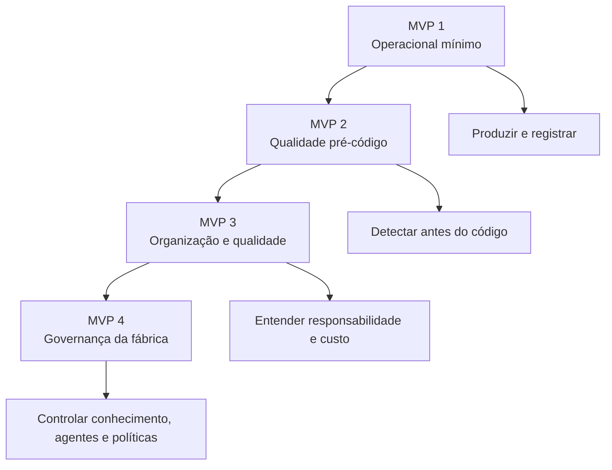
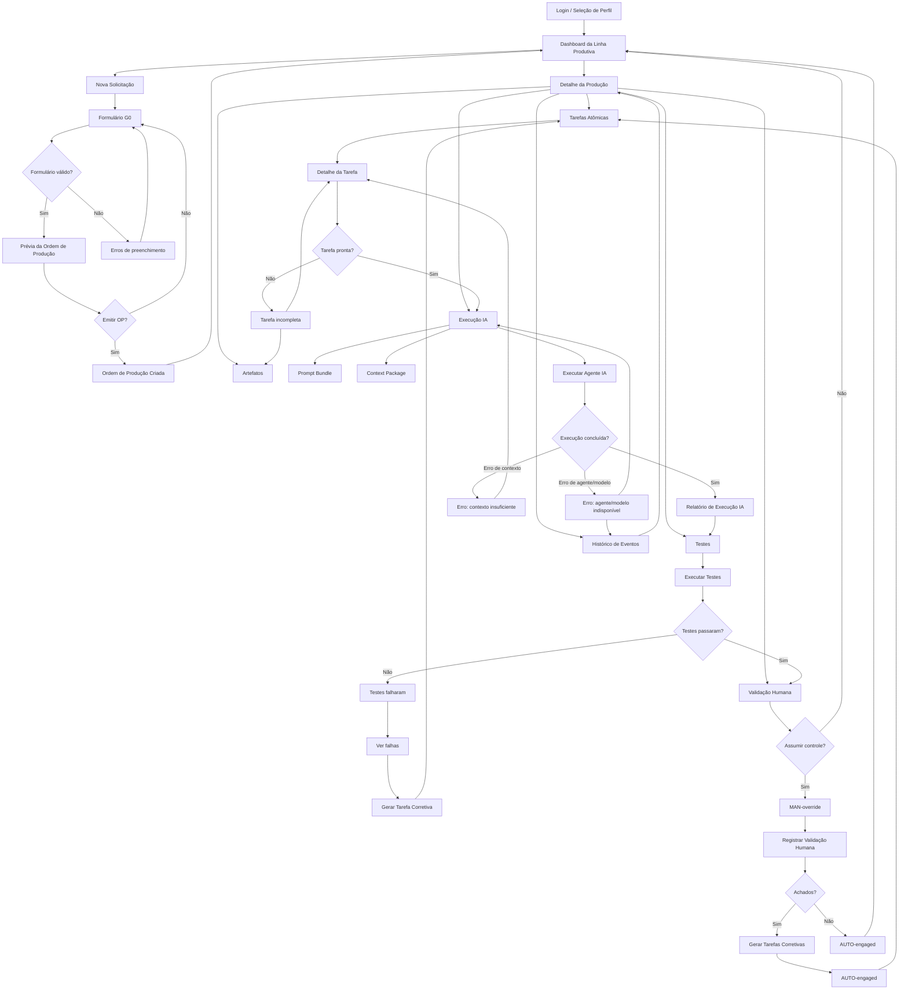
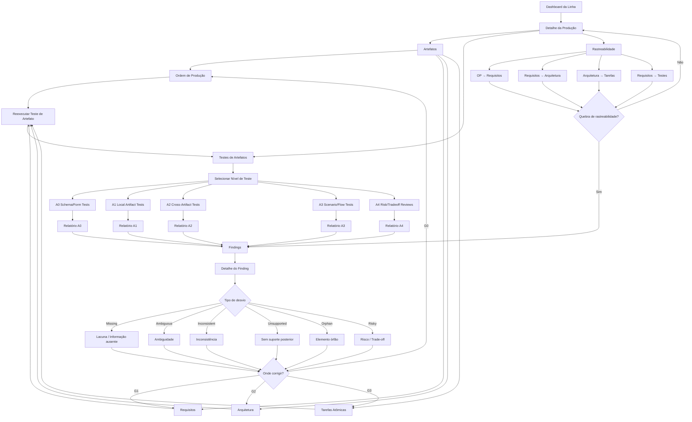
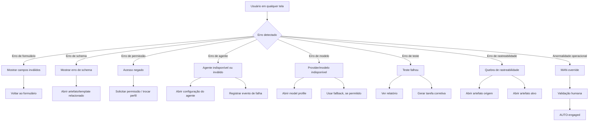

# AUTO — Navegação da Interface por MVPs

## 1. Visão geral

A interface do AUTO deve evoluir por MVPs, evitando construir um dashboard grande antes de existir operação real.

A evolução proposta é:

```text
MVP 1 — Operacional mínimo
MVP 2 — Qualidade pré-código
MVP 3 — Organização e qualidade
MVP 4 — Governança da fábrica
```



---

## 2. MVP 1 — Operacional mínimo

### Escopo

```text
Nova Solicitação
Dashboard da Linha
Artefatos
Tarefas Atômicas
Execução IA
Testes
Validação Humana
Histórico de Eventos
```

### Perguntas respondidas

```text
O pedido entrou?
Virou Ordem de Produção?
A tarefa está pronta?
A IA executou?
Os testes passaram?
O humano precisou assumir?
Tudo ficou registrado?
```

### Navegação



### Erros cobertos

```text
Formulário inválido
Tarefa incompleta
Contexto insuficiente
Agente indisponível
Modelo indisponível
Teste falho
Achado humano
Necessidade de MAN-override
```

---

## 3. MVP 2 — Qualidade pré-código

### Escopo

```text
Testes de Artefatos
Findings
Rastreabilidade OP → Requisitos → Arquitetura → Tarefas
```

### Objetivo

Encontrar defeitos antes da implementação.

### Navegação



### Erros cobertos

```text
Schema inválido
Artefato sem source_artifacts
Requisito sem critério de aceite
Requisito sem arquitetura correspondente
Componente sem requisito
Endpoint sem tarefa
Tarefa sem teste
Cenário sem suporte documental
Risco arquitetural sem mitigação
```

---

## 4. MVP 3 — Organização e qualidade

### Escopo

```text
Áreas de Negócio
Custo da Qualidade
Origem / Detecção / Correção
Pacote de Não-Retorno
```

### Objetivo

Mostrar a produção sob ótica organizacional.

### Perguntas respondidas

```text
Quem preveniu?
Quem detectou?
Quem corrigiu?
Quem deixou escapar?
Onde está o custo?
O que chegou na Expedição?
O que voltou?
```

---

## 5. MVP 4 — Governança

### Escopo

```text
Base de Conhecimento
Agentes
Model Profiles
Prompts
Routing Rules
Lifecycle Stage
Test Definitions
Políticas Operacionais
```

### Tela crítica

A tela de **Editar Agente** precisa impedir configurações perigosas.

```yaml
agent_validation:
  must_have:
    - agent_id
    - station_code
    - system_prompt
    - instructions
    - model_profile
    - input_contract
    - output_contract
    - permissions
    - business_area
    - quality_contribution_type

  forbidden:
    - deploy_permission_for_code_executor_without_release_operator
    - repository_write_for_architecture_agent
    - scoring_enabled_in_observe_mode
    - missing_output_schema
```

---

## 6. Rotas de erro transversais


